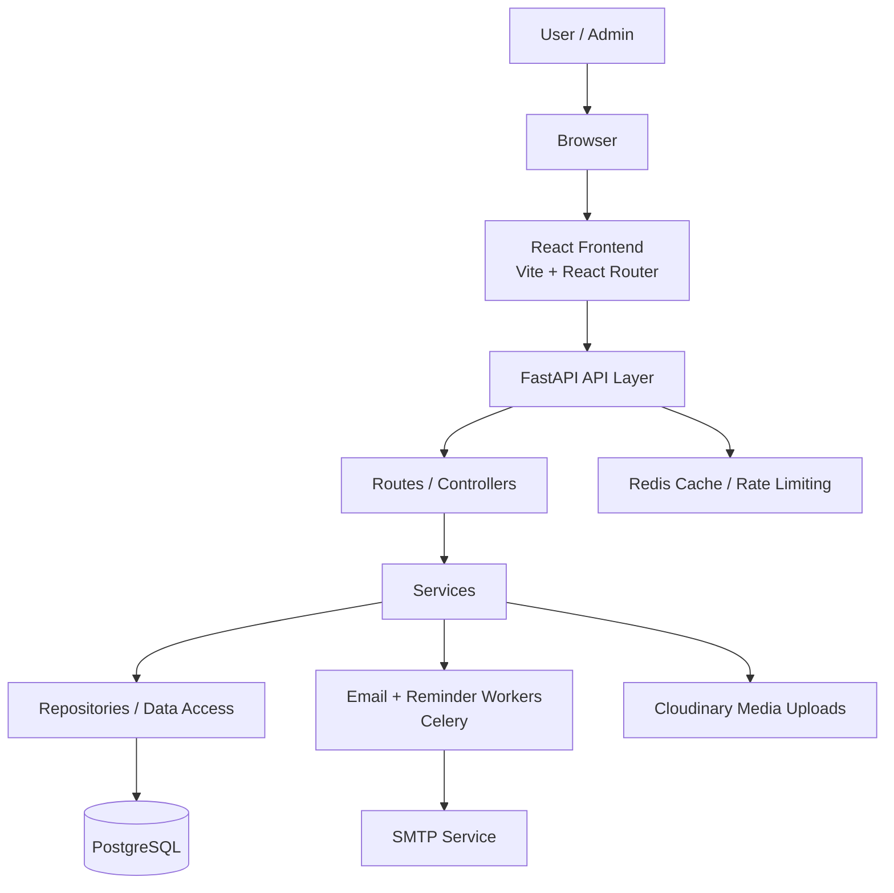
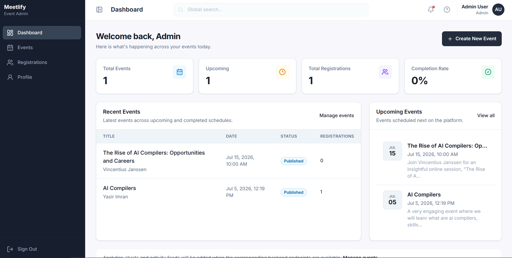
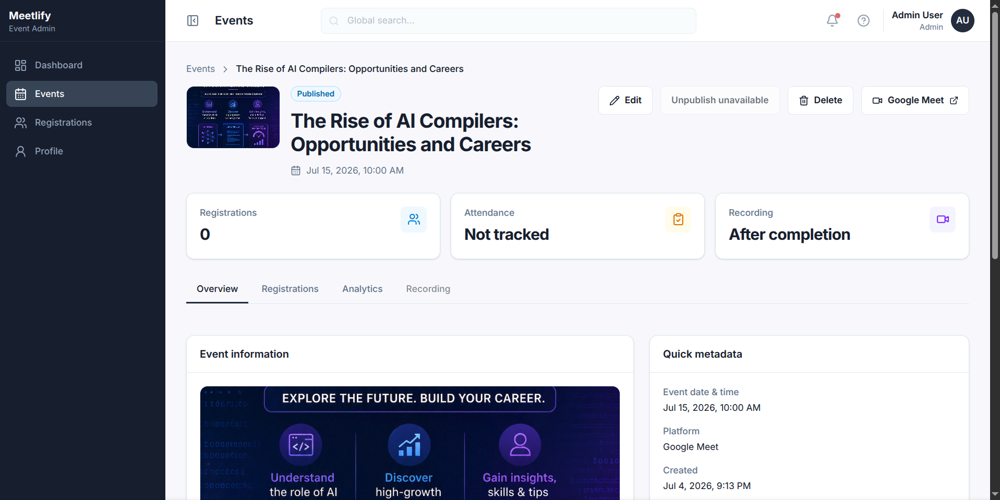
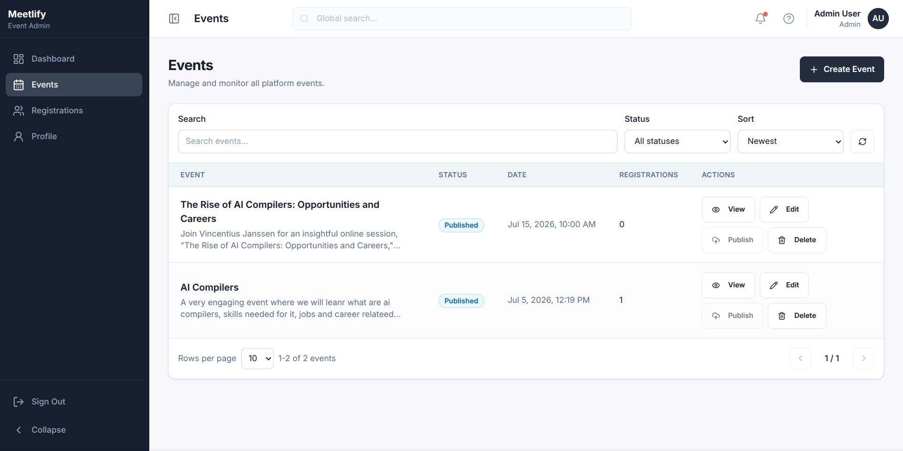
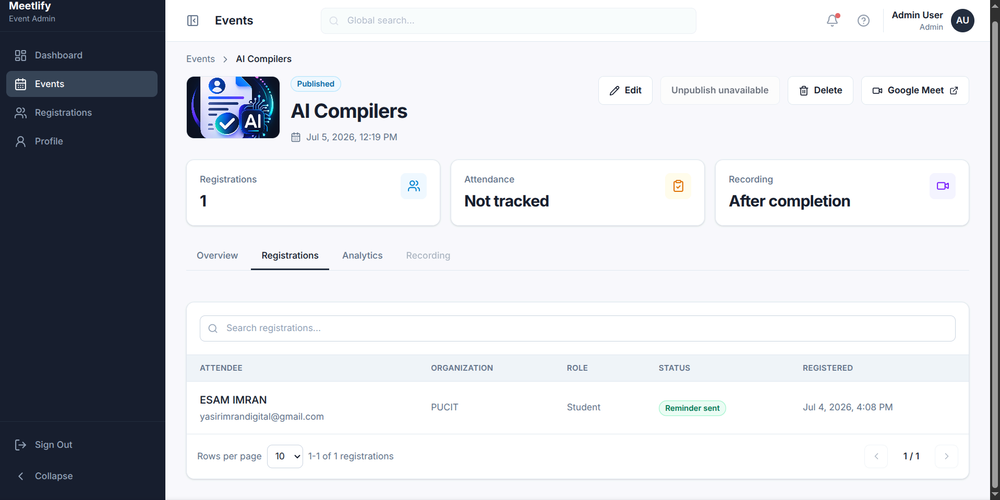
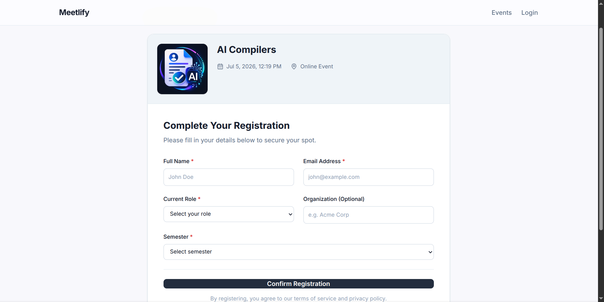
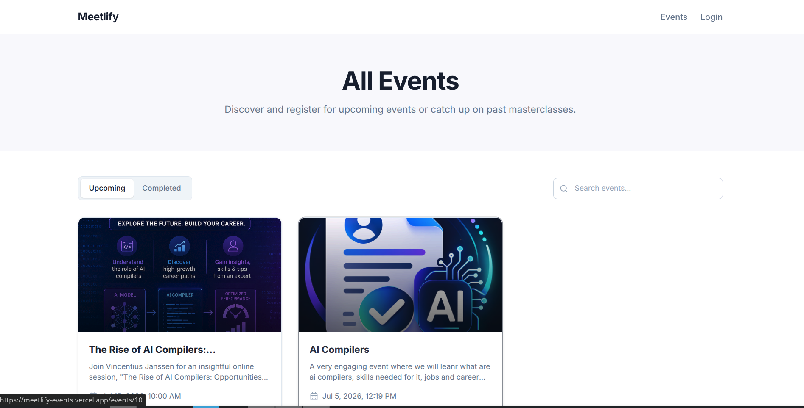

# Meetlify
Modern event management platform for hosting, promoting, and managing professional events with a polished public experience and a secure admin dashboard.


## Overview
Meetlify is a full-stack event management system designed for organizers PUCIT event organizers to publish events, capture registrations, and manage the end-to-end lifecycle of live sessions and masterclasses. The platform combines a modern public-facing event discovery experience with an admin dashboard for creating events, reviewing attendees, publishing content, and tracking event status.

The application demonstrates a production-minded architecture with a React frontend, a FastAPI backend, async database access, background email workflows, cloud-based media uploads, Redis-backed caching, and containerized services.

## Live Demo
Placeholder: https://meetlify-events.vercel.app/

## Features

### Authentication
- Admin login with email and password
- JWT access and refresh token issuance
- Protected admin routes using HTTP Bearer authentication
- Token-based session state in the frontend
- Guest-only access for the admin login view

### User Features
- Browse upcoming and completed events
- View detailed event pages with descriptions, speaker information, and meeting links
- Register for events through a structured form
- Receive registration confirmation emails
- Receive reminder emails before events begin

### Event Management
- Create new events with title, description, speaker, date/time, meeting link, and thumbnail
- Edit existing events
- Delete events
- Publish events from draft to published status
- Mark events as completed based on event date/time
- Upload event thumbnails to Cloudinary
- Attach video URLs to completed events

### Admin Dashboard
- Overview dashboard with totals for events, upcoming events, completed events, and registrations
- Event list management with search, status filtering, sorting, and pagination
- Event detail pages with overview, registrations, analytics, and recording tabs
- Registration management across all events
- Event analytics including registration counts and status

### Security
- Password hashing with bcrypt
- JWT-based authentication and authorization
- Redis-backed rate limiting for login and registration flows
- CORS configuration with an allowlist
- Environment-based configuration
- Pydantic-backed request validation
- Centralized exception handling

### UI/UX
- Responsive public website and admin dashboard
- Reusable UI components for buttons, cards, inputs, tabs, dialogs, badges, and tables
- Accessible form labels and focus states
- Loading, empty, error, and success states throughout the interface
- Consistent design system aligned with a modern SaaS aesthetic

### Notifications
- Registration confirmation emails
- Reminder emails sent one hour before an event starts
- Asynchronous background processing with Celery and Beat

### Search & Filtering
- Search public events by title
- Search admin events by title and status
- Search registrations by attendee name or email
- Filter registrations by reminder status

### Responsive Design
- Mobile-friendly public event browsing
- Desktop-first admin operations interface
- Adaptive layouts for cards, forms, tables, and navigation

### Performance
- Redis caching for event lists and event detail retrieval
- Async database operations with SQLAlchemy
- Pagination for large lists
- Background job processing for mail delivery and reminder scheduling

### API Features
- RESTful API design
- Standardized success responses
- Unified error response structure
- Health check endpoint

### Database Features
- Relational schema with explicit event-to-registration relationships
- Unique registration constraint per event and email
- Cascading delete behavior for registrations associated with an event

### Error Handling
- Custom application error classes
- Global validation error handling
- Global exception handling with structured JSON responses

### Validation
- Server-side validation for event payloads, registration payloads, email addresses, URLs, and dates
- Client-side form validation for login and event creation flows

## Tech Stack

### Frontend
- React 19.2.7
- React DOM 19.2.7
- Vite 8.1.0
- React Router DOM 7.18.1
- Axios 1.18.1
- Tailwind CSS 4.3.2
- Lucide React 1.23.0

### Backend
- Python 3.11
- FastAPI 0.136.3
- Uvicorn 0.49.0
- SQLAlchemy 2.0.50
- AsyncPG 0.31.0
- Alembic 1.18.4
- Pydantic 2.13.4
- Pydantic Settings 2.14.1
- Python-Jose 3.5.0
- Passlib 1.7.4
- Bcrypt 4.0.1

### Database
- PostgreSQL (via async SQLAlchemy connection)
- Redis for caching and rate limiting

### Authentication
- JWT access tokens
- JWT refresh tokens
- HTTP Bearer authentication
- bcrypt password hashing

### API
- REST API via FastAPI routers
- JSON response envelope with success/error metadata
- Upload endpoint for event thumbnails

### State Management
- React context for authentication state
- Local/session storage for persisted auth tokens

### Styling
- Tailwind CSS design tokens and utility classes
- Custom semantic color system

### Validation
- Pydantic server-side validation
- Frontend validation helpers for login and form submission

### Dev Tools
- Vite dev server
- Oxlint
- Docker Compose

### Deployment
- Docker-ready backend service
- Static frontend build output

### Package Manager
- npm for frontend
- pip for backend Python dependencies

### Version Control
- Git repository workflow

### Testing
- No automated test suite is currently present in the repository
- Will be wokring on it


### Containerization
- Dockerfile for the backend API service
- Docker Compose for API, worker, and beat services

### CI/CD
- Not configured in the repository
- In Future

### Other Libraries
- Cloudinary for image upload management
- Celery for background job processing
- SMTP email delivery via aiosmtplib
- Jinja2 for email templates

## Architecture



### Project Structure

```text
meetlify/
├── README.md
├── CONTEXT.md
├── DESIGN_SYSTEM.md
├── WORKFLOW.md
├── assets/
│   └── screenshots/
├── backend/
│   ├── Dockerfile
│   ├── docker-compose.yml
│   ├── README.md
│   └── app/
│       ├── main.py
│       ├── alembic.ini
│       ├── requirements.txt
│       ├── alembic/
│       ├── core/
│       ├── exceptions/
│       ├── models/
│       ├── repositories/
│       ├── routes/
│       ├── schemas/
│       ├── services/
│       ├── tasks/
│       ├── templates/
│       └── utils/
└── frontend/
    ├── package.json
    ├── vite.config.js
    ├── index.html
    └── src/
        ├── App.jsx
        ├── main.jsx
        ├── components/
        ├── constants/
        ├── contexts/
        ├── features/
        ├── hooks/
        ├── layouts/
        ├── services/
        ├── utils/
        └── assets/
```

## Database Design

Meetlify uses a relational schema with three core models.

| Model | Purpose | Key Fields | Relationships |
| --- | --- | --- | --- |
| User | Stores admin credentials | id, name, email, hashed_password, created_at | No direct relationship to events; used for admin authentication |
| Event | Stores event metadata and lifecycle state | id, title, description, speaker_name, meeting_link, status, event_date_time, thumbnail_url, thumbnail_public_id, video_url, created_at, updated_at | One event has many registrations |
| Registration | Stores attendee registration records | id, name, email, current_role, organization, semester, reminder_sent, event_id, created_at | Many registrations belong to one event |

### Relationships
- One Event has many Registration records.
- Each Registration belongs to one Event.
- The database enforces a unique constraint so the same attendee cannot register twice for the same event.
- Deleting an event cascades related registrations.

## API Overview

<details>
<summary><strong>Authentication</strong></summary>

- POST /api/v1/auth/login
  - Authenticates an admin user and returns access and refresh tokens.
- POST /api/v1/auth/refresh
  - Accepts a refresh token and returns a new access token.

</details>

<details>
<summary><strong>Public Events</strong></summary>

- GET /api/v1/events/upcoming
  - Returns paginated published events.
- GET /api/v1/events/completed
  - Returns paginated completed events.
- GET /api/v1/events/{event_id}
  - Returns the details for a single event.
- POST /api/v1/events/{event_id}/register
  - Registers a user for a specific event.

</details>

<details>
<summary><strong>Admin Events</strong></summary>

- GET /api/v1/admin/events
  - Lists admin-managed events with optional search, filtering, pagination, and status.
- GET /api/v1/admin/events/dashboard
  - Returns dashboard metrics and summary data.
- POST /api/v1/admin/events/upload-thumbnail
  - Uploads a thumbnail image and returns Cloudinary metadata.
- POST /api/v1/admin/events
  - Creates a new event.
- PUT /api/v1/admin/events/{event_id}
  - Updates an existing event.
- DELETE /api/v1/admin/events/{event_id}
  - Deletes an event.
- PATCH /api/v1/admin/events/{event_id}/upload-video-url
  - Attaches a recording or video URL.
- PATCH /api/v1/admin/events/{event_id}/publish
  - Publishes a draft event.
- GET /api/v1/admin/events/{event_id}/registrations
  - Lists registrations for a specific event.
- GET /api/v1/admin/events/{event_id}/analytics
  - Returns registration count and status for an event.

</details>

<details>
<summary><strong>Admin Registrations</strong></summary>

- GET /api/v1/admin/registrations
  - Lists registrations across all events with search, event filtering, status filtering, and pagination.

</details>

## Authentication Flow

1. The admin enters credentials on the login form in the React frontend.
2. The frontend sends the credentials to the FastAPI authentication endpoint.
3. The backend validates credentials against the stored bcrypt hash in the database.
4. If successful, the backend issues an access token and a refresh token.
5. The frontend stores the tokens in local or session storage and marks the user as authenticated.
6. Protected admin routes call the backend with a Bearer token.
7. The backend verifies the token and authorizes the admin before returning protected data.
8. Refresh tokens can be used to obtain a new access token when needed.

## Security Features
- JWT access and refresh tokens
- bcrypt password hashing
- HTTP Bearer authentication for protected admin routes
- Redis-backed rate limiting for login and registration endpoints
- CORS allowlist configuration
- Pydantic request validation
- Environment-based secrets management
- Centralized exception handling for predictable API errors

## Performance Optimizations
- Redis caching for event lists and event detail pages
- Asynchronous SQLAlchemy sessions for non-blocking database access
- Paginated API responses for large event and registration lists
- Background job processing for email reminders and event completion tasks
- Efficient filtering and search on the backend and frontend

## Error Handling
The backend uses a layered error-handling approach:
- Custom application exceptions for domain-specific failures
- Global exception handlers for application errors
- Validation handlers for malformed requests
- Structured JSON responses with clear success/error metadata

This results in consistent API behavior for validation failures, authorization issues, duplicate registrations, missing events, and unexpected server errors.

## Screenshots

### Hero Section


### Admin Dashboard


### Admin Event Detail


### Admin Event Management


### Event Registrations


### Event Registration Form


### Public Events Page


## Installation

### 1. Clone the repository

```bash
git clone <your-repo-url>
cd meetlify
```

### 2. Backend setup

```bash
cd backend/app
python3 -m venv .venv
source .venv/bin/activate
pip install -r requirements.txt
```

Create a backend environment file based on the sample configuration:

```bash
cp ../.env.example ../.env
```

Then update the values for your PostgreSQL, Redis, Cloudinary, and SMTP services.

### 3. Frontend setup

```bash
cd ../../frontend
npm install
```

Create a frontend environment file if needed:

```bash
cp .env.example .env
```

Set the API base URL for the frontend:

```env
VITE_API_URL=http://localhost:8000
```

### 4. Run locally

Start the backend:

```bash
cd backend/app
uvicorn main:app --host 0.0.0.0 --port 8000 --reload
```

Start the frontend:

```bash
cd frontend
npm run dev
```

### 5. Run with Docker

The repository includes Docker Compose services for the API, worker, and beat processes:

```bash
cd backend
docker compose up --build
```

> The project expects PostgreSQL and Redis services to be available through the configured environment variables.

## Environment Variables

| Variable | Description |
| --- | --- |
| DATABASE_URL | Async PostgreSQL connection string used by SQLAlchemy |
| SECRET_KEY | Secret key used for signing JWTs |
| SQL_ALCHEMY_URL | Declared application setting for database configuration |
| ACCESS_TOKEN_EXPIRE_MINUTES | Token lifetime for access tokens |
| ALGORITHM | JWT signing algorithm |
| CLOUDINARY_CLOUD_NAME | Cloudinary cloud name |
| CLOUDINARY_API_KEY | Cloudinary API key |
| CLOUDINARY_API_SECRET | Cloudinary API secret |
| REDIS_URL | Redis connection URL for cache and rate limiting |
| SMTP_HOST | SMTP host for outbound email |
| SMTP_PORT | SMTP port |
| SMTP_USERNAME | SMTP username |
| SMTP_PASSWORD | SMTP password |
| EMAIL_FROM | Sender address for outbound emails |
| ALLOWED_ORIGINS | Comma-separated CORS origins |
| VITE_API_URL | Frontend API base URL |

## Deployment

Meetlify can be deployed in a standard production setup by hosting:
- the FastAPI backend on render
- the React frontend as a static site or Vite-compatible build host
- PostgreSQL and Redis as external services
- Cloudinary and SMTP credentials through environment variables

For containerized deployment, the backend Docker setup is already prepared through the provided Dockerfile and Compose configuration.

## Future Improvements
- Add an automated test suite for backend and frontend
- Introduce CI/CD pipelines for build and deployment validation
- Add audit logs and admin activity tracking
- Add email verification and password reset workflows
- Add richer analytics dashboards and charts
- Add role-based permission management for multiple admin users
- Generative AI for writing descriptions of the events

## Author

Yasir Imran 

## Linked 

https://linkedin/in/yasir-imran

